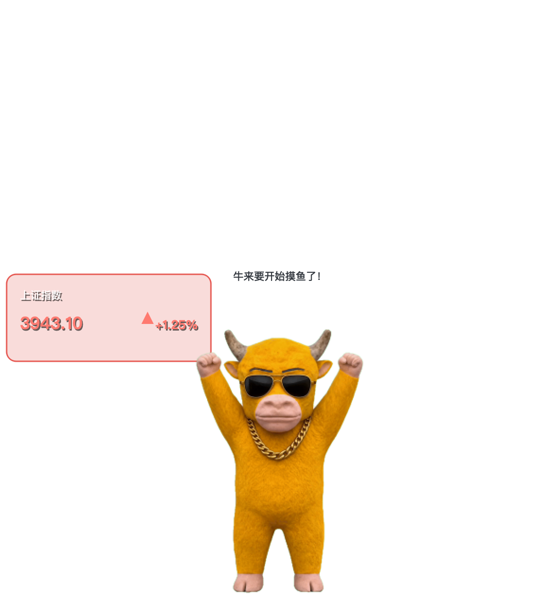

# 牛来行情桌宠 🐂📈

一个跟随 A 股行情变身的 macOS 桌面宠物：平时坐在骰子上思考，鼠标悬停后按实时涨跌变身——上涨戴金链欢呼、狂拉和豹拉双人舞、下跌拉开拉链变成熊大坐地大哭。

A desktop pet for macOS that reacts to live China A-share market data. It sits on a question-mark cube by default; hover to reveal its market form based on real-time price movement.



## 玩法 / Features

| 操作 | 效果 |
|------|------|
| 默认 | 牛来坐骰子思考（无卡片无气泡，每次启动全新状态） |
| 鼠标悬停 | 变身当前行情形态 + 左侧红/绿迷你行情卡（指数名、股价、涨跌幅，红▲涨绿▼跌） |
| 移开鼠标 | 保持行情形态 |
| 双击 | 回到普通思考状态 |
| 单击 | 跳跃/压扁/抖动小动效 |
| 右键 | 刷新行情 / 更换标的（六大指数+个股）/ 置顶 / 静音 / 演示模式 |

**涨跌自动动作**：默认关闭。若在 `config.json` 中将 `enable_auto_actions` 设为 `true`，狂涨（≥+3%）台词播完后会打开抖音，下跌（≤-0.1%）播完后会打开 WPS 开始上班（各 30 分钟冷却）。普通上涨只庆祝不开网页。

## 快速开始 / Quick Start

```bash
# 需要 uv（brew install uv）
双击 启动桌宠.command
# 或
uv venv --python 3.12 .venv
uv pip install -p .venv/bin/python -r requirements.txt
.venv/bin/python app.py
```

打包独立 App：双击 `打包桌宠.command`，生成 `dist/牛来行情桌宠.app`。

## 行情数据 / Market Data

优先通过千问办公 `a-stock-realtime` Skill 桥接（`tools/quote_bridge.py` 写 quote.json），自动降级新浪财经接口直连。数据源在行情卡上如实标注，非交易时段显示收盘数据。详见 [CONNECTOR.md](CONNECTOR.md)。

## 目录结构 / Structure

```text
app.py                 入口（单实例锁、日志、截图自测）
src/                   窗口/动画/行情/状态机/音频/气泡
assets/                处理后的透明帧序列 + WAV 音频（tools/ 从原始素材生成）
原始素材/              原始 GIF / PNG / MP3（含角色形象，注意版权）
desktop-pet-stock.skill  可导入千问办公的复刻技能
tools/                 素材导入、抠图、去边、行情桥接
tests/                 单元测试
```

## 素材版权说明

「牛来」「熊大」「豹拉」角色形象及音频来自动画 IP，本项目仅作个人学习与演示用途。公开传播或商用前请自行确认授权；换角色只需替换 `原始素材/` 中的 GIF 与音频，运行 `tools/import_gif.py` 重新导入。

## License

代码部分 MIT。素材版权归原 IP 所有者。
